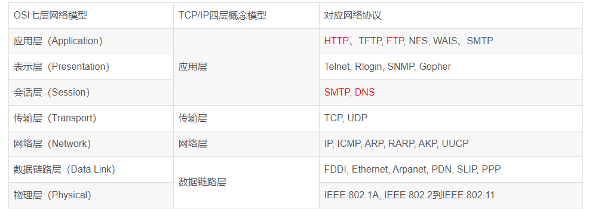

## 计算机网络

### 浏览器输入Url发生了什么？

1. 输入网址

2. 缓存解析

- 浏览器缓存：浏览器会记录DNS一段时间，因此，只是第一个地方解析DNS请求；

- 操作系统缓存：如果在浏览器缓存中不包含这个记录，则会使系统调用操作系统，获取操作系统的记录(保存最近的DNS查询缓存)；

- 路由器缓存：如果上述两个步骤均不能成功获取DNS记录，继续搜索路由器缓存；

- ISP缓存：若上述均失败，继续向ISP搜索。

3. 域名解析,解析获取相应的IP地址

4. 浏览器向服务器发起tcp连接，与浏览器建立tcp三次握手。

5. 握手成功后，浏览器向服务器发送http请求，请求数据包

6. 服务器处理收到的请求，将数据返回至浏览器

7. 浏览器收到HTTP响应

8. 读取页面内容，浏览器渲染，解析html源码

9. 生成Dom树、解析css样式、js交互

10. 客户端和服务器交互

11. ajax查询

### TCP/IP网络模型

TCP/IP模型是互联网的基础，它是一系列网络协议的总称。这些协议可以划分为四层，分别为链路层、网络层、传输层和应用层。

- 链路层：负责封装和解封装IP报文，发送和接受ARP/RARP报文等。
- 网络层：负责路由以及把分组报文发送给目标网络或主机。
- 传输层：负责对报文进行分组和重组，并以TCP或UDP协议格式封装报文。
- 应用层：负责向用户提供应用程序，比如HTTP、FTP、Telnet、DNS、SMTP等。

### OSI七层模型

- 物理层
机械、电子、定时接口通信信道上的原始比特流传输
- 数据链路层
物理寻址，同时将原始比特流转变为逻辑传输线路
- 网络层
控制子网的运行
- 传输层
接收上一层的数据，在必要的时候把数据进行分割，并将这些数据交给网络层
- 会话层
不用机器上的用户之间建立及管理会话
- 表示层
信息的语法语义以及他们的关联，如加密解密、转换翻译、压缩解压缩等
- 应用层
各种应用协议，比如HTTP、FTP、Telnet、DNS、SMTP等。

### OSI七层和TCP/IP四层的关系

OSI引入了服务、接口、协议、分层的概念，TCP/IP借鉴了OSI的这些概念建立TCP/IP模型。

OSI先有模型，后有协议，先有标准，后进行实践；而TCP/IP则相反，先有协议和应用再提出了模型，且是参照的OSI模型。

OSI是一种理论下的模型，而TCP/IP已被广泛使用，成为网络互联事实上的标准。

### OSI七层和TCP/IP的区别

- TCP/IP他是一个协议簇；而OSI（开放系统互联）则是一个模型，且TCP/IP的开发时间在OSI之前。
- TCP/IP是由一些交互性的模块做成的分层次的协议，其中每个模块提供特定的功能；OSi则指定了哪个功能是属于哪一层的。
- TCP/IP是五层结构，而OSI是七层结构。OSI的最高三层在TCP中用应用层表示。

### 路由器和交换机的区别

交换机工作于数据链路层，用来隔离冲突域，连接的所有设备同属于一个广播域（子网），负责子网内部通信。

路由器工作于网络层，用来隔离广播域（子网），连接的设备分属不同子网，工作范围是多个子网之间，负责网络与网络之间通信。

工作层次不同：

- 交换机主要工作在数据链路层（第二层）
- 路由器工作在网络层（第三层）。

主要功能不同：
- 交换机主要用于组建局域网，
- 而路由主要功能是将由交换机组好的局域网相互连接起来，或者接入Internet。
- 交换机能做的，路由都能做。
- 交换机不能分割广播域，路由可以。
- 路由还可以提供防火墙的功能。
- 路由配置比交换机复杂。

### 三次握手和四次挥手

#### TCP三次握手：
1、客户端发送syn包到服务器，等待服务器确认接收。
2、服务器确认接收syn包并确认客户的syn，并发送回来一个syn+ack的包给客户端。
3、客户端确认接收服务器的syn+ack包，并向服务器发送确认包ack，二者相互建立联系后，完成tcp三次握手。四次握手就是中间多了一层 等待服务器再一次响应回复相关数据的过程

三次握手之所以是三次是保证client和server均让对方知道自己的接收和发送能力没问题而保证的最小次数。

- 第一次client => server 只能server判断出client具备发送能力
- 第二次 server => client client就可以判断出server具备发送和接受能力。此时client还需让server知道自己接收能力没问题于是就有了第三次
- 第三次 client => server 双方均保证了自己的接收和发送能力没有问题

#### 为什么要四次挥手？
TCP是全双工信道，何为全双工就是客户端与服务端建立两条通道，通道1:客户端的输出连接服务端的输入；通道2:客户端的输入连接服务端的输出。两个通道可以同时工作：客户端向服务端发送信号的同时服务端也可以向客户端发送信号。所以关闭双通道的时候就是这样：

客户端：我要关闭输入通道了。
服务端：好的，你关闭吧，我这边也关闭这个通道。

服务端：我也要关闭输入通道了。
客户端：好的你关闭吧，我也把这个通道关闭。